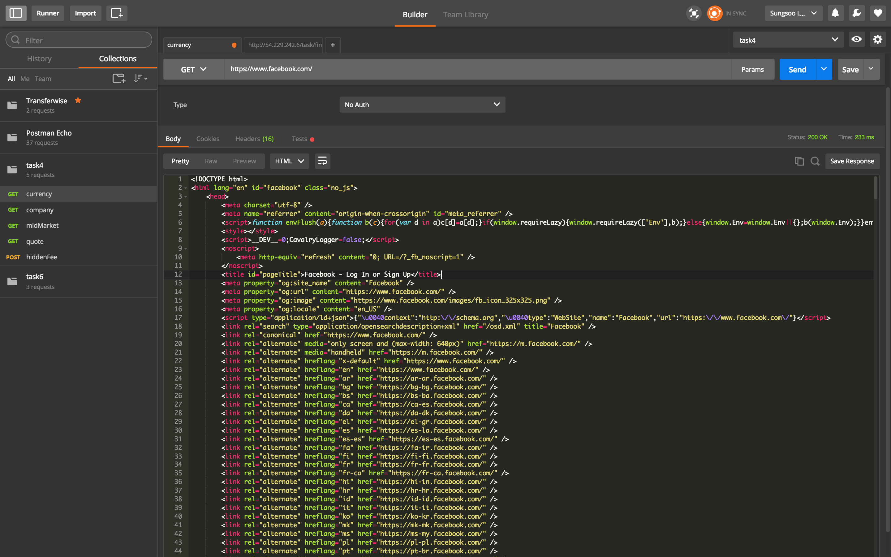
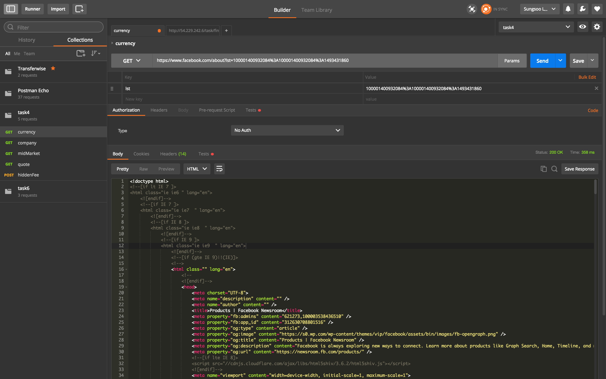
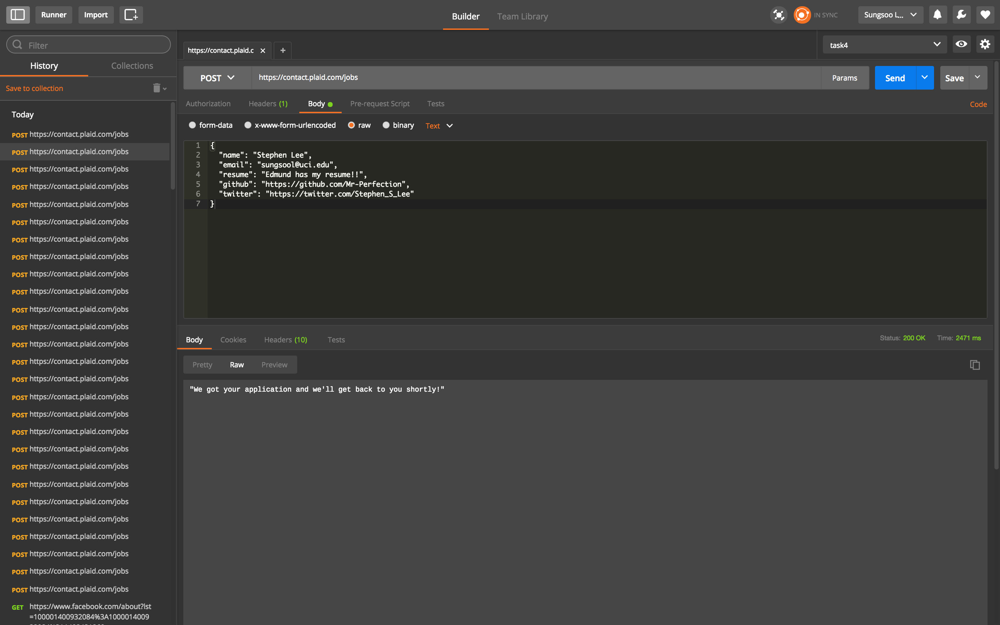
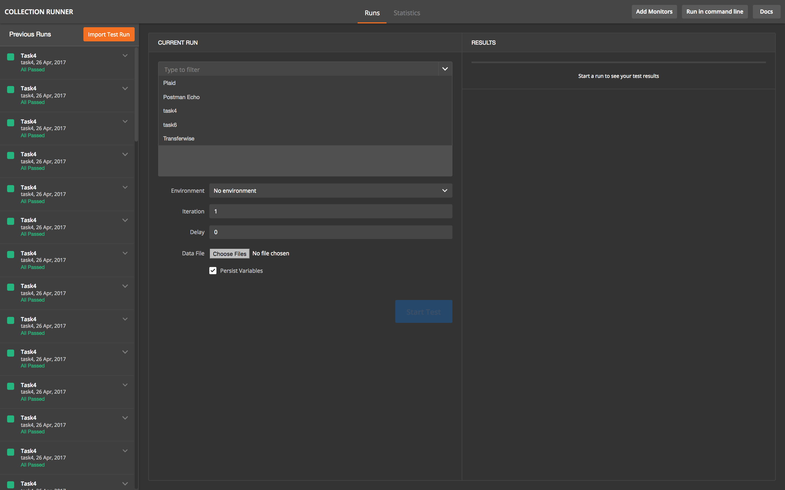

# postman-tutorial-for-newbies
Are you new to Postman? I got you covered!

### Introduction
I have recently done coding challenge for [TransferWise](https://transferwise.com/us/) and realized I had to use a dev tool in order
to submit my solutions to their server! I sort of knew about [Postman](https://www.getpostman.com/) and realized I would need to use it to send requests to submit my solutions (with Rest API). It was easy in the beginning of the problems that they want me to solve which only includes few requests. After few problems and as I moved up to more difficult problems, I realized *holy molly* there is no way I will send requests individually, and I need to figure out how to automate tests (the whole purpose of programming), so I don't need to spend hours on just sending request manually.
This repo will help you how to use Postman in general and dive into [Collection Runner](https://www.getpostman.com/docs/running_collections) which will help you run automated tests.
**I will discuss about some basics in the beginning and dive into collection runner which is a more advanced topic.**

### Setup
I would assume you already have Postman downloaded on your computer. I am using *MacOS Version 10.12* and downloaded Postman for Mac.


### How to do /GET request?
1. Specify request to GET and put targeted URL
2. Click Send


3. You can even add some *paramaters* too! Click params right next to url. I used FB about page.


### How to do /POST request?
1. In this example, I will be applying to this cool [startup](https://plaid.com/careers/#apply-by-api) my friend works at [via API](https://plaid.com/careers/#apply-by-api).
2. Set body as raw JSON:
```
{
  "name": "name",
  "email": "email",
  "resume": "resume",
  "github": "blah",
  "twitter": "https://twitter.com/Stephen_S_Lee"
}
```
3. Then send request as a POST request.


### Collection Runner
I will be using some similar examples that I did for **TransferWise coding challenge** but I will be explaining my logic.
All the codes go into `Tests` section. Also, make sure to create a collection by clicking *Collections* tab and the *plus sign*.
You have to include the requests that you will be running into that collection so it can do loops once *Collection runner has launched*.
1. Let's say you have `/payment` as GET request to get JSON objects.
```js
// GET /payment
let jsonData = JSON.parse(responseBody);

let foos = [],
    bars = [];
jsonData.forEach(function(element) {
    //...
    foos.push(element.id);
    bars.push(element.id);
    //...
});
// Removing the first element from foos and set it as foo env var.
postman.setEnvironmentVariable("foo", foos.shift());
// Convert the list object foos into JSON data type
postman.setEnvironmentVariable("foos", JSON.stringify(foos));

// ..
postman.setEnvironmentVariable("bar", bars.shift());
//..
postman.setEnvironmentVariable("bars", JSON.stringify(bars));
tests["let's start foo first: " + environment.id] = true;
postman.setNextRequest('foo'); // this will call the next request called foo (you can name your request)
```

2. In `/payment/{{foo}}/frog` as PUT request, you update foo and mark it as `frog`.
Wait a minute. What is {{}} thingy? That is environment variable we set. That value will be used in there.
if `foo` is set to `hello` then the whole URL will be like `/payment/hello/frog`:)

```js
tests["FROG!"] = true;              // debug message
const ids = JSON.parse(postman.getEnvironmentVariable('foos'));

// this ensures when to go to next request & terminate infinite loops
if (ids.length > 0) {
    postman.setEnvironmentVariable('foo', ids.shift());
    postman.setEnvironmentVariable('foos', JSON.stringify(ids));
    postman.setNextRequest('foo'); // we are running foo requests until foos run out of elements
    tests["PUT"] = true;
} else {
    // clear env. vars
    postman.clearEnvironmentVariable('foo');
    postman.clearEnvironmentVariable('foos');
    tests["Complete marking foosters!"] = true;
    // move onto the next request
    postman.setNextRequest('bar');
}
```
2. In `/payment/{{bar}}/frog` as DELETE request, you do same thing
```js
tests["FROG2!"] = true;              // debug message

const ids = JSON.parse(postman.getEnvironmentVariable('bars'));

if (ids.length > 0) {
    postman.setEnvironmentVariable('bar', ids.shift());
    postman.setEnvironmentVariable('bars', JSON.stringify(ids));
    postman.setNextRequest('bar');
    tests["DELETE"] = true;
} else {
    postman.clearEnvironmentVariable('bar');
    postman.clearEnvironmentVariable('bars');
    tests["THE END"] = true;
}
```

It is highly recommended to do testing for every request that you created (unit testing) and check if environment variables actually
store the values by clicking *eye icon* on the top right corner.
Once everything is working properly, start the *collection runner by clicking runner button at the top right corner*.


Choose which collection to run and that's it!!

I really hope you found this useful. I struggled to use collection runner in the beginning but with trials and errors (and googling), I was able to figure out how to use **Colection Runner** properly. Good luck!

### references
good tutorial: https://thisendout.com/2017/02/22/loops-dynamic-variables-postman-pt2/
